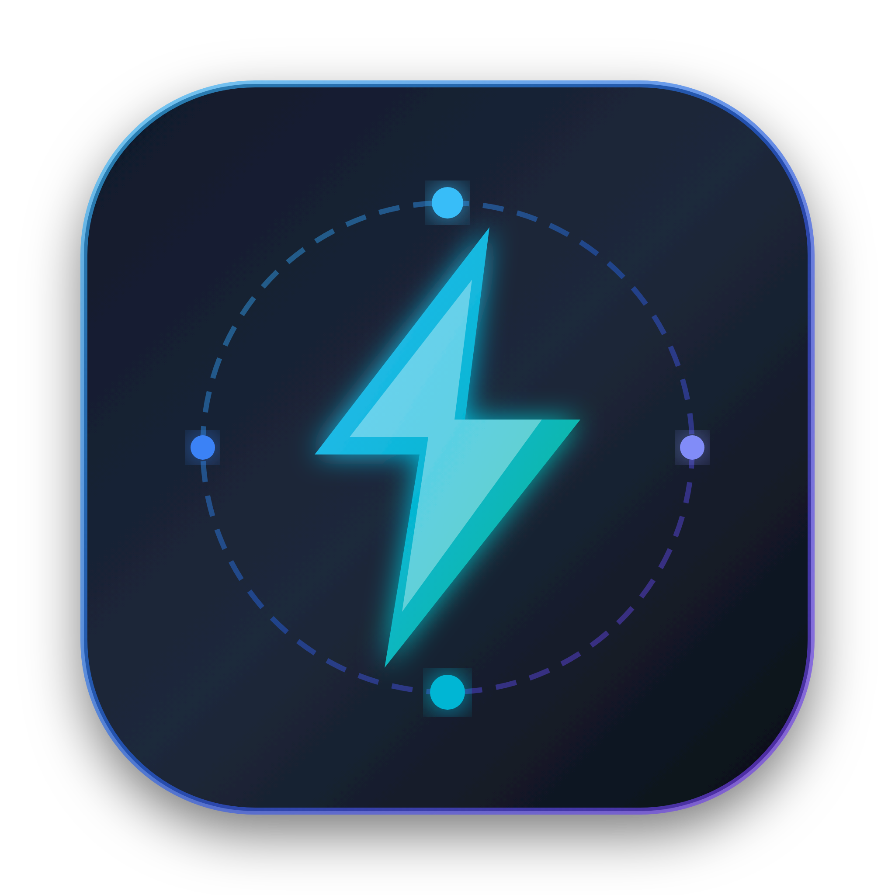
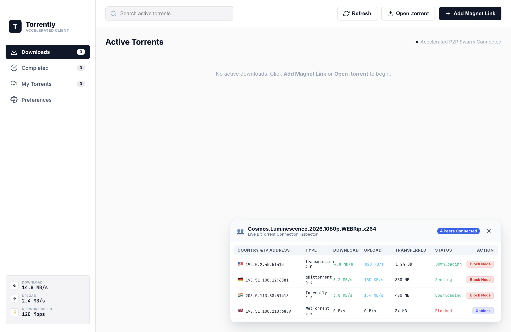
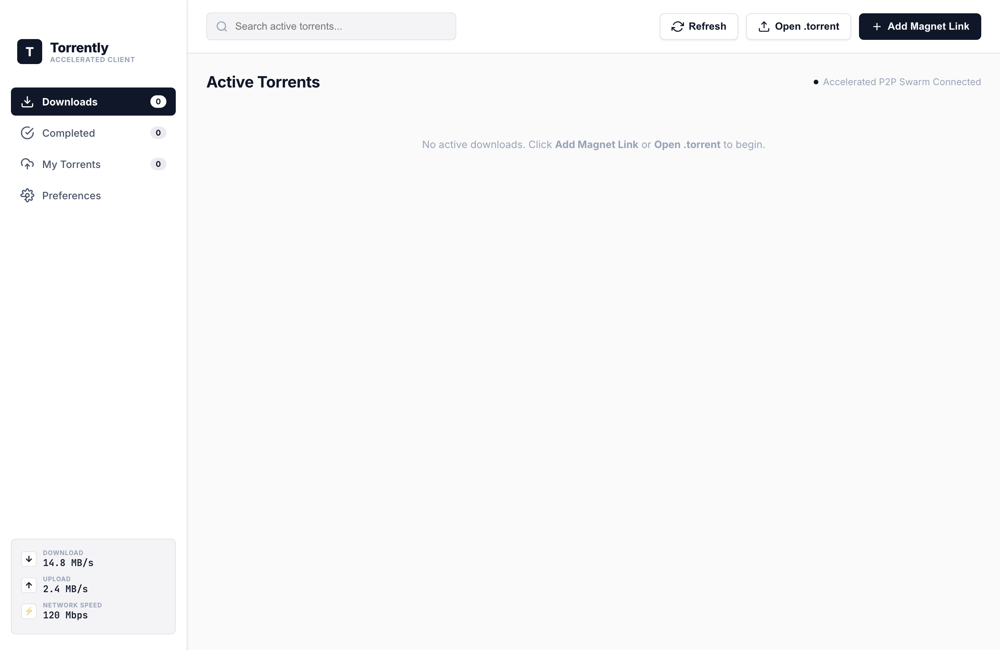

# Torrently ⚡

<div align="center">
  
  <h3>High-Performance Desktop BitTorrent Client & Instant Streamer</h3>
  <p>Stream HD videos and audio directly as they download, package and seed custom torrents, track peers globally with country flags, and block unwanted nodes.</p>

  [](LICENSE)
  [](https://github.com/vikeshvee/torrently)
  [](https://electronjs.org)
  [](https://webtorrent.io)
  [](#running-tests)
</div>

---

## 📸 Screenshots

### 1. Active Downloads & Media Streaming Dashboard
Track active torrent downloads with live progress, true individual sub-file speeds, playable media stream indicators, and dynamic speed gauges.
<p align="center">
  
</p>

---

### 2. "My Torrents" Creator & Seeding Hub
Create and seed torrents from files or directories, monitor swarm data transfers, and manage active uploads.
<p align="center">
  
</p>

---

### 3. Swarm Inspector, Country Flags & Node Blocking
Inspect connected peers with automatic country flag resolution, download/upload rates, and the ability to ban or unblock individual nodes on the fly.
<p align="center">
  
</p>

---

### 4. Create Torrent from File or Folder
Recursively package entire directories or single files into torrents with custom trackers, comments, and private swarm options.
<p align="center">
  
</p>

---

## 🚀 Key Features

- 🎬 **Instant Media Streaming**: Stream video and audio sequentially while pieces download. Watch in the embedded HTML5 player with volume/mute memory or cast to external players (VLC, IINA, MPV).
- 📁 **Selective File Downloading**:
  - Uncheck files you don't want to download.
  - Overall progress and downloaded percentage are calculated strictly from wanted files.
  - Torrents mark completion as soon as your selected files finish.
- ⚡ **True Per-Sub-File Download Speed**: Individual sub-files display their own real-time speed, rather than copying the overall torrent's speed.
- 📊 **Dynamic Speed Indicator & Network Test**:
  - Bottom-left gauges display aggregate download and upload bandwidth across all active torrents.
  - Interactive **Network Speed Test** meter to benchmark your connection speed in real time.
- 📦 **"My Torrents" Creation**:
  - Package any single file or entire folder tree into a standard `.torrent` file.
  - Generates instant Magnet URIs for peer sharing.
  - Tracks connected nodes, swarm progress, and total uploaded data.
- 🛡️ **Peer Node Management & Geolocation**:
  - Built-in offline GeoIP engine maps peer IP addresses to ISO country codes and flag emojis (🇺🇸, 🇩🇪, 🇮🇳, 🇬🇧, etc.).
  - Identify peer client software (Transmission, qBittorrent, WebTorrent, uTorrent).
  - **Block Node**: Instantly chokes and terminates connections with suspicious or leeching peers, blacklisting them from reconnecting.
- 🔄 **State Persistence & Disk Verification**:
  - Automatically preserves paused and completed torrents across app restarts.
  - Performs intelligent disk rescanning to verify existing files, resume interrupted downloads without duplicate downloads, and detect deleted files.
- 🎯 **OS Integration**:
  - Double-click `.torrent` files or click `magnet:` links in your browser to open Torrently automatically.
  - Press `Escape` anywhere to instantly dismiss dialogs and modal inspectors.
  - Draggable, resizable columns in the multi-file accordion.

---

## 🛠️ Tech Stack & Architecture

Torrently is built with modern web and desktop technologies optimized for performance and reliability:

| Component | Technology | Description |
| :--- | :--- | :--- |
| **Runtime & Shell** | [Electron 30](https://www.electronjs.org/) | Cross-platform desktop application environment with native system integration. |
| **Torrent Engine** | [WebTorrent 3.0](https://webtorrent.io/) | Full BitTorrent protocol implementation with DHT, PEX, MSE, and tracker support. |
| **Stream Server** | [Express](https://expressjs.com/) & [Node.js](https://nodejs.org/) | Local HTTP range-request server (`http://127.0.0.1:8888`) enabling seekable in-flight media streaming. |
| **Peer Geolocation** | Custom Offline GeoIP Engine | Fast binary search over global IP allocations, resolving country codes and flags without external API latency. |
| **Packaging & Dist** | [electron-builder](https://www.electron.build/) | Produces signed, notarizable `.dmg`, `.zip`, and cross-platform distribution bundles. |
| **UI & Styling** | Vanilla JavaScript, HTML5 & CSS3 | Dark glassmorphism interface, CSS custom property grid resizers, zero heavy frontend framework overhead. |

---

## 📥 Installation

### Option 1: Pre-Built macOS Installer (Recommended)

1. Download **`Torrently-1.0.0-arm64.dmg`** from the [Releases](https://github.com/vikeshvee/torrently/releases) page.
2. Double-click the `.dmg` file to open the installer window.
3. Drag the **Torrently** icon into the **Applications** folder.
4. Launch **Torrently** from your Applications or Spotlight (`Cmd + Space`).

> **Note for macOS:** If you see a warning on first launch, right-click `Torrently.app` in `/Applications` and select **Open**.

---

### Option 2: Build from Source

#### Prerequisites
- [Node.js](https://nodejs.org/) (version 18 or higher)
- [npm](https://www.npmjs.com/) (version 9 or higher)
- Git

#### Step-by-Step Setup
```bash
# 1. Clone the repository
git clone https://github.com/vikeshvee/torrently.git
cd torrently

# 2. Install dependencies
npm install

# 3. Launch in development mode
npm start

# 4. Run automated test suite
npm test
```

#### Package an Installable File (.dmg and .zip)
```bash
# Generate macOS DMG installer and portable ZIP archive
npm run dist

# Output files will be available in the dist/ directory:
# - dist/Torrently-1.0.0-arm64.dmg
# - dist/Torrently-1.0.0-arm64-mac.zip
```

---

## 🧪 Running Tests

The test suite runs with Node.js built-in test runner without requiring external test dependencies:

```bash
npm test
```

Includes 29 unit and integration tests covering:
- BitTorrent piece boundaries and transmission bencode parser
- Selective file download progress calculations
- Real-time per-file download speed tracking
- Peer node blocking, choking, and blacklist enforcement
- In-flight media streaming detection
- GeoIP country flag extraction
- State persistence and volume level restoration

---

## 👨‍💻 Developer & Author

**Developed by**: [vikeshvee@gmail.com](mailto:vikeshvee@gmail.com)  
**GitHub**: [@vikeshvee](https://github.com/vikeshvee)

---

## 📄 License

This project is licensed under the MIT License - see the [LICENSE](LICENSE) file for details.
